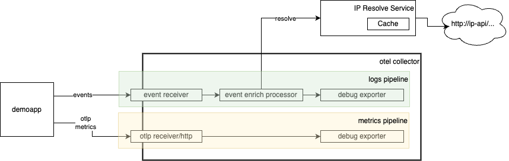

# Otelcol custom pipeline

Repository contains the implementagion of OpenTelemetry collector metric and custom event processing pipelines with custom event receiver and enricher processor adding metadata to logs records.



## Overview

### Demoapp
Produces log events and counter metrics with Opentelemety SDK.

### Ip Resolve Service
Implements the service of resolving metadata by IP with caching mechanism.

### Event receiver
Custom Otel Collector receiver receiving event messages, converting them to Otel and propagaing to pipeline.

### Event Enrich Processor
Custom Otel Collector processor adding metadata to log records by ip address calling IP Resolve Service

## Run
```shell
make -C ipresolveservice run & make run & make -C demoapp run
```

## Verify
Refer to debug exporter output and see both OTel metrics and OTel Log records having metadata
